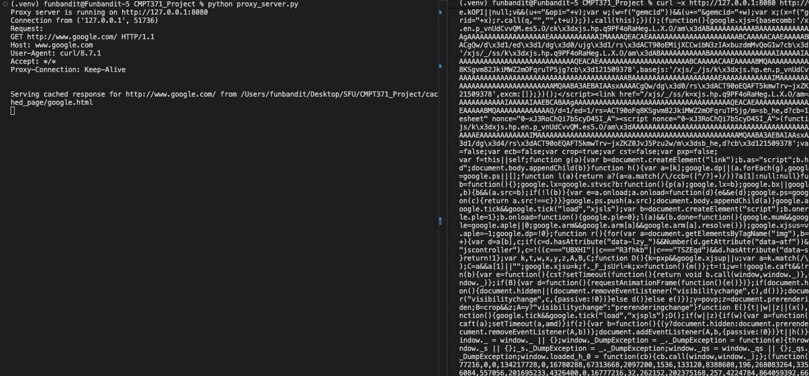
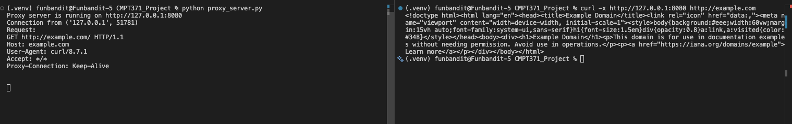
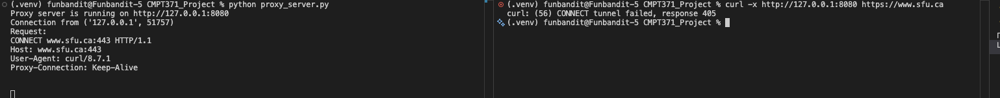

# Step 4

## Difference between a web server and a proxy server
A web server is a software application that serves web pages to users over the internet. It handles requests from clients (such as web browsers) and delivers the requested content, such as HTML files, images, and other resources. Web servers are responsible for hosting websites and managing the communication between clients and the server.

A proxy server is a server that acts on behalf of another server. It receives requests from clients and forwards them to the appropriate destination server. The proxy server can also cache responses from the destination server, which can improve performance by reducing the number of requests that need to be made to the original server.

## Specification

### Connection
- Listen on port 8080 for incoming client requests.
- Sequentially handle request or use multithreading to handle multiple requests simultaneously.

### Resquest Parsing
- Only support HTTP GET requests. Throw an error for any other request methods.
- URI Parsing: The proxy must expect the Request-URI in absolute-form.

Input Example: GET http://www.example.com:80/path/to/file.html HTTP/1.1

The proxy must parse this string to extract the hostname https://www.example.com, the port (defaulting to 80 if absent), and the path (/path/to/file.html). 

- Version Parsing: Identify if the client is using HTTP/1.0 or HTTP/1.1.

### Request Forwarding
- Forward the parsed request to the destination web server. convert the absolute-form URI to origin-form before forwarding.
- Header Modification: 
- The proxy must forward the request headers to the destination server, creating a new header if it is missing.
- For a minimal, non-persistent proxy, it should force the connection to close after the transaction by appending or modifying the header: Connection: close.
- append a via header to indicate that the request was forwarded by the proxy server. For example: Via: 1.1 proxy-server-name.

### connection termination
- The proxy must close the connection to the client after sending the response.
### Caching
- Webpage caching is control by network admin. Only selected webpages are cached. The proxy server will check if the requested webpage is in the cache before forwarding the request to the destination server. If the webpage is in the cache, the proxy server will serve the cached response to the client. If the webpage is not in the cache, the proxy server will forward the request to the destination server and cache the response for future requests.

## Test

Cache hit:
Proxy server will serve the response from the cache.
```bash
curl -x http://127.0.0.1:8080 http://www.google.com
```


Cache miss:
Proxy server will fetch the response from the host.
```bash
curl -x http://127.0.0.1:8080 http://example.com
```


405 Method Not Allowed:
proxy server does not support Connect method, so it will return a 405 Method Not Allowed error when trying to access https://www.sfu.ca.
```bash
curl -x http://127.0.0.1:8080 https://www.sfu.ca
```


502 Bad Gateway:
www.0thomas1.com is a non-existent domain, so the proxy server will return a 502 Bad Gateway error when trying to access it.
```bash
curl -x http://127.0.0.1:8080 http://www.0thomas1.com
```


## Multi-threading
The proxy server can handle multiple requests simultaneously by using multithreading. Each incoming request is handled in a separate thread, allowing the proxy server to process multiple requests concurrently. This improves performance by distributing the requests across multiple threads.